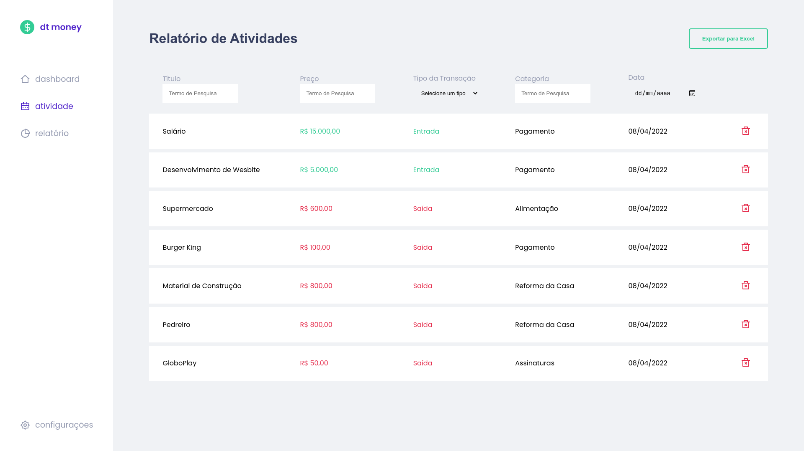
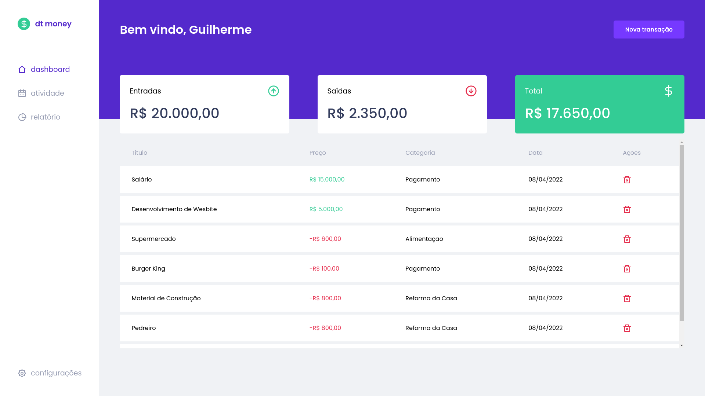
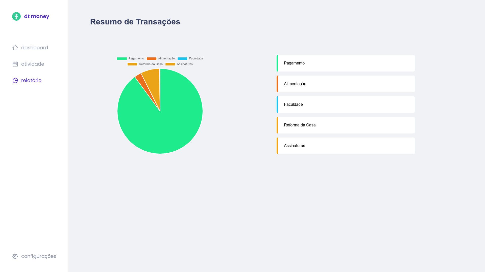

<p align='center'>
  
</p>

<p align='center' >
   
  
  
  
</p>

<p align='center' >
  💰 <strong>dt.money</strong> is a simple, easy, free to use and the most important, it's open source!!
</p>

<div align="center">
  <sub> Made with 💖 by
    <a href="https://github.com/Guigalaverna">Guigalaverna.
  </sub>
</div>

# 📌 Table of Content
- [📌 Table of Content](#-table-of-content)
- [📷 Screenshots](#-screenshots)
- [🚀 Technologies](#-technologies)
  - [🧠 Frameworks](#-frameworks)
  - [🖌️ Stylish](#️-stylish)
  - [📔 Data](#-data)
  - [📦 Storage](#-storage)
  - [🔒 Authentication](#-authentication)
  - [🧪 Testing](#-testing)
  - [🧰 Tools](#-tools)
- [🏃 How to Run](#-how-to-run)
- [🐛 Issues](#-issues)
- [✨ Contributing](#-contributing)
- [:page_facing_up: License](#page_facing_up-license)

# 📷 Screenshots
<div align="center">
   
   
   
</div>

# 🚀 Technologies
This project is made with a lot of technologies, this is the list of them:
## 🧠 Frameworks
- [React.js](https://reactjs.org)
- [Next.js](https://nextjs.org)
## 🖌️ Stylish
- [Stitches](https://stitches.dev)
- [React Icons](https://react-icons.github.io/react-icons/)

## 📔 Data
- [React Table](https://react-table.tanstack.com/)
- [Chart.js](https://chartjs.org)
- [React Chart.js](https://www.npmjs.com/package/react-chartjs-2)

## 📦 Storage
- [Nookies](https://www.npmjs.com/package/nookies)
- [FaunaDB](https://fauna.com) (not used yet)
## 🔒 Authentication
- [NextAuth](https://next-auth.js.org)

## 🧪 Testing
- [Jest](https://jestjs.io)
- [Testing Library](https://testing-library.com)

## 🧰 Tools
- [uuid](https://npmjs.com/package/uuid)
- [XLSX](https://npmjs.com/package/xlsx)

Each listed technology is used to specific functionalty, for example:
- [XLSX](https://npmjs.com/package/xlsx) is used to export data to **Microsoft Excel**
  
# 🏃 How to Run
To run the project, first you need to clone the repository and install the dependencies:
```bash
$ git clone https://github.com/Guigalaverna/dt.money.git # Clone the repository
$ cd dt.money # Go to the project folder
$ npm install # Install the dependencies
```
Now you can run the project:
```bash
$ npm run dev
```
> Pssst. You can also run the tests:
> ```bash
> $ npm run test
> ```

# 🐛 Issues

Create a <a href="https://github.com/Guigalaverna/dt.money/issues">new issue report</a>, it will be an honor to be able to help you solve and further improve our application.

# ✨ Contributing

- Fork this repository;
- Create a branch with your feature: `git checkout -b my-feature`;
- Commit your changes: `git commit -m 'feat: My new feature'`;
- Push to your branch: `git push origin my-feature`.

# :page_facing_up: License

This project is under the [MIT license](./LICENSE).
Made with 💖 by Guigalaverna.

Thank you! 🌠